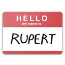

## node.js 설치하기

nvm을 이용해서 node.js를 설치한다.  

windows 에서는 nvm-windows를 사용한다.  
[nvm 다운로드 받는곳](https://github.com/coreybutler/nvm-windows/releases)

```bash
nvm install lts

node -v # 버전확인

# 만약 경로를 찾을수 없다고 나오면 버전을 수동으로 활성화 시킨다.
nvm use lts

nvm list # 설치된 버전 확인
```


## 스크래치 소스 다운받기

```bash
git clone https://github.com/gbox3d/scratch-vm.git
git clone https://github.com/gbox3d/scratch-gui.git

```

## 스크래치 소스 실행하기

### scratch-vm 실행하기

gui 와 vm 중 에서 vm을 먼저 실행한다. 다음에 gui를 실행한다.   

```bash
# vm 실행
cd scratch-vm
npm install # 처음 한번만 실행
npm run build 
nom link  # 이 저장소를  전역적으로 scratch-vm이라는 이름으로 패키지를 사용힐수 있게 한다.
```

### 스크래치 gui 실행하기

```bash
cd scratch-gui
npm install # 처음 한번만 실행
npm run build
npm link scratch-vm # 원래 package.json 에 있는 scratch-vm 대신에 위에서 링크한 패키지(scratch-vm)를 사용하게 한다. 

npm start
```

만약 확장기능을 추가하지않는 다면 위의과정( scratch-gui )으로 실행하면 된다.  

## 확장기능 추가하기

확장기능을 추가하기 위해서는 scratch-vm을 수정해야 한다.  

### 확장기능 소스 폴더 추가하기  

원하는 scratch3_확장이름 을 만들고 그안에 index.js 파일을 만든다.  
경로는 scratch-vm/src/extensions/ 에 폴더를 만들고 그안에 확장 기능 모듈 소스를 만들어 넣는다.  
맨처음으로 index.js 파일을 추가한다.    

예>
scratch-vm/src/extensions/scratch3_hello/index.js

```javascript
const BlockType = require('../../extension-support/block-type');

class Scratch3HelloBlocks {
    constructor (runtime) {
        this.runtime = runtime;
    }

    getInfo () {
        return {
            id: 'hello',
            name: 'Hello',
            blocks: [
                {
                    opcode: 'sayHello',
                    blockType: BlockType.REPORTER,
                    text: 'say hello'
                }
            ]
        };
    }

    sayHello (args, util) {
        return 'hello';
    }
}

module.exports = Scratch3HelloBlocks;
    
```

### 확장기능을 등록하기
scratch-vm/src/extension-support/extension-manager.js 파일에 추가한 확장을 등록한다.  

```javascript

const builtinExtensions = {
    // 기존 확장들...
    pen: () => require('../extensions/scratch3_pen'),
    hello: () => require('../extensions/scratch3_hello') // 추가된 부분
};

```

### 확장기능을 gui 에 추가하기

scratch-gui/src/lib/libraries/extensions/확장이름 폴더를 만들고 그안에 확장기능에 대한 아이콘 이미지 파일을 넣는다.  

예>
```txt
scratch-gui/src/lib/libraries/extensions/hello/hello.png
scratch-gui/src/lib/libraries/extensions/hello/hello-small.png
```




scratch-gui/src/lib/libraries/extensions/index.jsx 파일에 확장기능을 추가한다.   

```javascript
import helloIconURL from './hello/hello.png';
import helloInsetIconURL from './hello/hello-small.png';

// ... 기존 import 구문들 ...

export default [
    // ... 기존 확장들 ...
    {
        name: (
            <FormattedMessage
                defaultMessage="Hello"
                description="Name for the 'Hello' extension"
                id="gui.extension.hello.name"
            />
        ),
        extensionId: 'hello',
        iconURL: helloIconURL,
        insetIconURL: helloInsetIconURL,
        description: (
            <FormattedMessage
                defaultMessage="Returns hello message."
                description="Description for the 'Hello' extension"
                id="gui.extension.hello.description"
            />
        ),
        featured: true
    },
    // ... 나머지 확장들 ...
];

```
